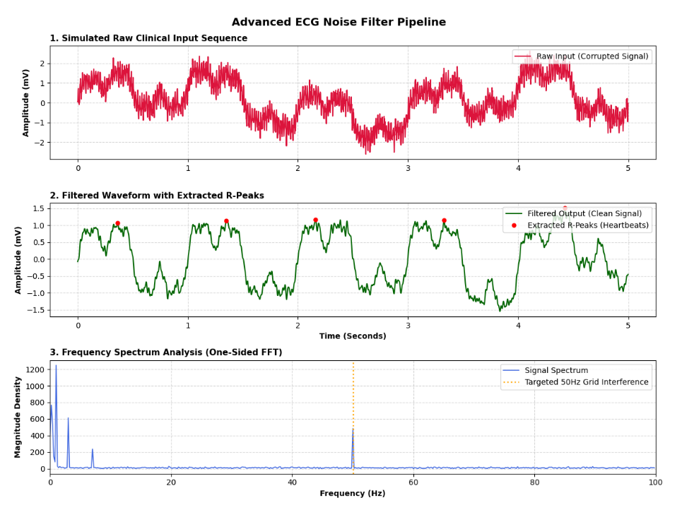
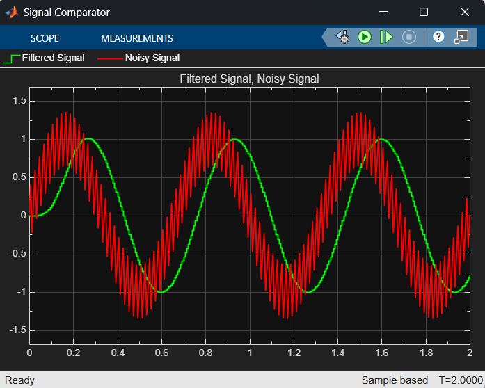

# Biomedical Signal Processing Portfolio: Cross-Platform ECG Noise Filter Pipeline

This repository showcases a comparative engineering study designed to isolate, filter, and extract diagnostic feature metrics from electrocardiogram (ECG) signals corrupted by typical clinical noise artifacts. 

The project highlights the technical migration and architectural evolution of a digital signal processing (DSP) system, moving from a graphical lab prototype in MATLAB/Simulink to a production-ready software environment in Python.

---

## 📊 Visual Pipeline Verification

### 1. Python Production Framework Output
The modern Python framework successfully attenuates both deterministic grid noise and stochastic muscle tremors, utilizing automated peak localization to map cardiac cycles.



### 2. MATLAB / Simulink Prototype Output
The initial graphical model demonstrates robust attenuation of target sinusoidal frequencies within the lab environment.



---

## 🔄 The Evolution of the Pipeline

1. **MATLAB / Simulink Prototype (`/matlab_implementation`)**
   * **Core Files:** `ecg_filter.slx` (Simulink Model), `init_parameters.m` (Workspace Initialization Script).
   * **Scope:** Establishes the mathematical baseline framework. Cleans deterministic, synthetic sinusoidal interferences comprising low-frequency baseline wander ($0.3\text{ Hz}$) and standard European powerline grid hum ($50\text{ Hz}$).

2. **Python Production Framework (`/python_implementation`) [UPGRADE]**
   * **Core Files:** `ecg_pipeline.ipynb` (Jupyter Diagnostic Workbook).
   * **Stochastic Noise Integration:** Upgraded to simulate real-world clinical variations by injecting high-frequency, non-deterministic muscle tremors (stochastic white noise modeled via a Gaussian normal distribution using NumPy's `default_rng`).
   * **Zero-Phase Digital Filtering:** Implemented a 4th-order IIR Butterworth bandpass filter ($0.5\text{ Hz} - 40\text{ Hz}$) using `scipy.signal.filtfilt` to fully isolate and suppress the broad noise profile without introducing phase distortion or temporal displacement of crucial peaks.
   * **Clinical Feature Extraction:** Integrated automated R-peak localization via `scipy.signal.find_peaks` to programmatically extract individual heartbeat coordinates directly from the processed time-series arrays.

---

## 📊 Technical System Comparison

| Engineering Phase | MATLAB / Simulink Prototype | Python Production Framework |
| :--- | :--- | :--- |
| **Simulated Noise Matrix** | Deterministic ($0.3\text{ Hz}$ + $50\text{ Hz}$) | Deterministic + Stochastic Muscle Tremors |
| **Array Architecture** | Native Matrix Workspace Variables | Memory-Optimized `numpy.ndarray` Structures |
| **Spectral Conversion** | Command Line `fft()` / Spectrum Blocks | `scipy.fft.fft` Frequency Density Vectors |
| **Filter Configuration** | 4th-Order Butterworth Filter Design | 4th-Order Butterworth Bandpass (`scipy.signal`) |
| **Phase Stabilization** | Workspace Filter Visualizer Tuning | Forward-Backward Zero-Phase Execution (`filtfilt`) |
| **Automated Analytics** | Manual Graphical Visualizer Evaluation | High-Throughput R-Peak Detection (`find_peaks`) |

---

## 🛠️ How to Initialize and Run the Workspace

### System Requirements
* MATLAB & Simulink (R2022a or newer)
* Python 3.10+ (with NumPy, SciPy, Matplotlib)

### Execution Sequence

#### Evaluating the Python Production Code:
```bash
cd python_implementation
jupyter notebook ecg_pipeline.ipynb
```

#### Evaluating the MATLAB Prototype:
1. **Open MATLAB** and navigate to the `matlab_implementation/` directory.
2. **Run** `init_parameters.m` to load the system coefficients into your active workspace.
3. **Open and simulate** `ecg_filter.slx` inside the Simulink environment to view the graphical block architecture.

```matlab
% You can also run the initialization script directly from the MATLAB command window:
run('matlab_implementation/init_parameters.m')
```